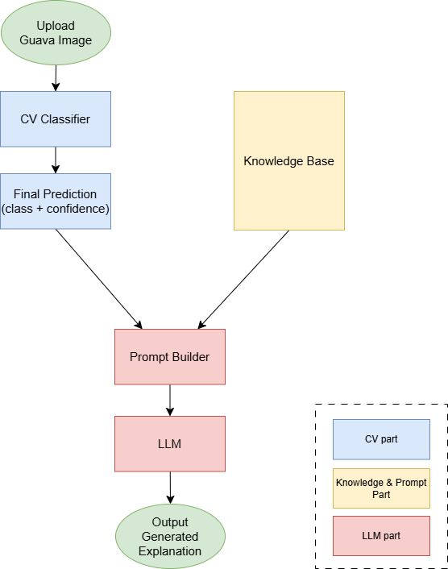

# GuavaDiseaseLLM
## System Pipeline

The workflow:

1. Input a guava image  
2. Computer vision model predicts disease category  
3. System loads predefined disease knowledge  
4. Prompt is constructed based on prediction result  
5. LLM generates explanation and handling suggestions  

---

## Dataset

This project uses the public guava disease dataset available on Kaggle:
[Guava Disease Dataset](https://www.kaggle.com/datasets/tamimresearch/guavadiseasedataset)

The dataset contains images of:

- Anthracnose
- Fruit fly damage
- Healthy guava

This dataset is used for model training and experimentation only.

---

## System Pipeline

---

## Quick Start
### Installation

Clone repository:  
`git clone https://github.com/Pickle411/GuavaDiseaseLLM.git` 
`cd GuavaDiseaseLLM`

Install dependencies: 
`pip install -r requirements.txt`

---

### Environment Setup

Before running the LLM module, set your Groq API key as an environment variable: 
`export GROQ_API_KEY=your_key`

---

### Run LLM Module
`python -m llm.llm_response`

---

### Run UI
`python -m ui.app`

---

## Future Work

### Version 2  
CV + RAG + LLM  

- Vector database  
- Retrieval mechanism  

### Version 3  
Conversational agricultural AI  

- Multi-turn dialogue  
- Interactive decision support
